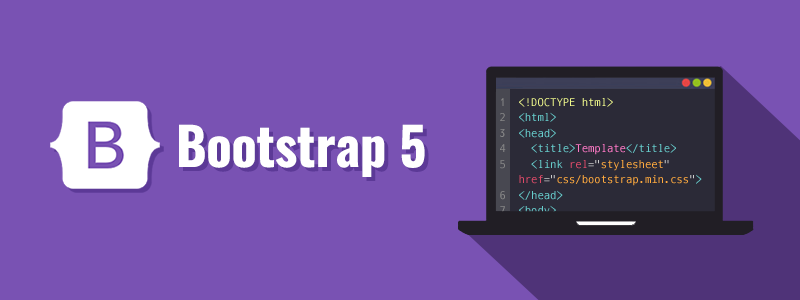

## Boots with Straps Help Your Shoes Stay On Better

I'm going to be bluntly honest: before starting this module, I had pretty much never heard of Bootstrap in my life. I had no idea what I was about to get myself into and really had no interest in anything to do with it. However, once I was able to utilize it across different areas, I realized that boots with straps really do help your shoes stay on better.

In short, Bootstrap is essentially a collection or bundle of built-in tools that helps organize a web interface. Instead of having to create every single navigation bar, button, or even spacing rule individually, Bootstrap comes with built-in classes that help take some of that weight off your shoulders. When I first started to utilize it, I thought that it was a complete waste of time, and it felt almost as if I was learning a new language. Looking back on it now, I realize that it has saved me so much time in the long run with all of the different and complex tasks that I have had to do.

## BootBelt

One of the most helpful factors of Bootstrap is that it comes with built-in tools. Instead of having to do things from the bottom up, Bootstrap gives you a little boost that can save you a lot of time in the future. Classes, components, and more are already made and in place to automatically handle formatting issues such as spacing, alignment, navigation bars, and columns. Previously, during web development, I was manually controlling the layouts of websites directly through HTML and CSS. If you really think about it, Bootstrap is exactly like a tool belt for your boots. Looking for, picking up, and grabbing each tool can take up a lot of unnecessary time, and Bootstrap makes it all accessible right at your waistline.

During one of my assignments, I was tasked with recreating navbars from businesses such as Boardroom Kailua, Aloha Beer, and Duke's Waikiki. Although, on the outside, the navigation bars all looked different, the structure of their Bootstrap foundations could be reused. I found myself reusing the same code for each website and changing more of its appearance, such as the color or alignment, instead of starting from scratch every time.

## Why Not Just Use HTML and CSS?

Don't get me wrong, using strictly HTML and CSS is completely viable. It can give you more control over your code and can be very helpful in specific situations. However, the tradeoff is that you would have to create many of these things yourself. Instead of quickly utilizing Bootstrap's navbar system, you may find yourself writing the styling and responsive behavior on your own. This may get out of hand when there are multiple tasks or websites that you have to deal with. Though it definitely took a lot of time, I think learning what Bootstrap is and how it can be utilized was an investment that will take me far in my web development journey.

To wrap everything up, I would be wrong to say that Bootstrap completely replaces the need for HTML and CSS programming. I do, however, think that those who are going into web development or have any interest in HTML or CSS programming should take a look at Bootstrap and its capabilities. Rather than taking the time to understand one or the other, I believe that if you combine a strong understanding of Bootstrap with HTML and CSS, you can become an awesome web developer. Though it will take some extra time to get through the learning curve and understand its complexity, I like to think of it this way: work hard now, work less later.

*AI Use: AI was used to help with grammatical errors as well as the overall flow of this essay. Ideas are all my own.*
